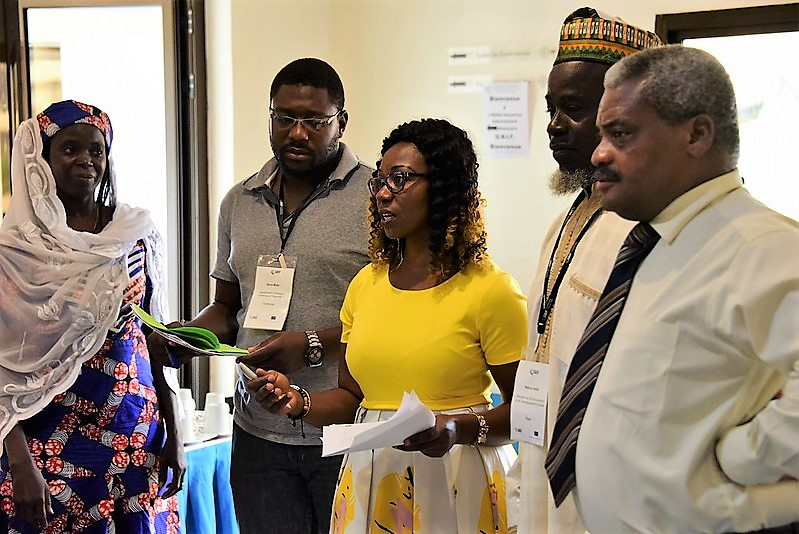

[multipage-level=2]
== Building a case for formal engagement in GBIF

[NOTE.objectives]
*Objectives*

In this module, we will:

* describe what is involved in the modes of formal GBIF Participation and the benefits this brings
* understand how individuals, institutions and countries can participate in GBIF
* identify and prioritize stakeholders to engage in moving towards GBIF Participation

=== Understanding GBIF's value
The starting point for building a case for a country or international organization to formally participate in GBIF is to understand the value of GBIF as data infrastructure and an international network. In this section, we will explore GBIF’s relevance through a series of videos focusing on the contributions to research and policy thematic areas. 

[NOTE.activity]
While watching the videos in this section, consider rationale that could help you to build a case for participation in the GBIF network. Keep note of these in your exercise sheet.

[NOTE.presentation]
In this video (10:08) from the GBIF Impact and Action Symposium, 2021, GBIF's Executive Secretary, Dr. Joe Miller, discusses GBIF's relevance for science and policy. 
If you are unable to watch the embeded Vimeo video, you can download it locally.

video::656603612[vimeo, height=540, width=960, align=center]

[NOTE.presentation]
In these six videos (<15:00) you will learn about the value of GBIF to different thematic areas. 
If you are unable to watch via the embeded Vimeo showcase, the videos can be downloaded locally from the <<downloads,downloads page>>.

ifdef::backend-pdf[]
The presentation can be viewed in the online version of the course.
endif::backend-pdf[]

ifndef::backend-pdf[]
++++

<iframe src='https://vimeo.com/showcase/9461923/embed' allowfullscreen frameborder='0' style='position:absolute;top:0;left:0;width:100%;height:100%;'></iframe>

++++
endif::backend-pdf[]

=== Process for becoming a GBIF Participant

TIP: Before going further, go back and review the https://docs.gbif.org/course-introduction-to-gbif/en/introduction-to-gbif-participant-nodes.html[Introduction to GBIF Participant nodes section] of the pre-requisite course, in which we discussed the modes of formal Participation in GBIF as an intergovernmental network and research infrastructure. 

The details of how to become a member of GBIF, the description of Participant categories, the GBIF Memorandum of Understanding, and other templates are all provided on the GBIF website. 

[NOTE.documentation]
Read through the information on https://www.gbif.org/become-member[how to become a member^] in detail. It is important to understand this process before moving on to the rest of the course. Be sure to review the https://www.gbif.org/document/80661/gbif-memorandum-of-understanding[GBIF Memorandum of Understanding^] to understand the commitments that GBIF Participants make when joining the network.

[NOTE.activity]
To learn more about how countries and organizations join GBIF, explore examples of new Participants available in recent news items. Keep notes from these examples in your exercise sheet.

* Go to the https://www.gbif.org/resource/search?contentType=news[news section of the GBIF website]
* Look for new items related to new Participants joining the network, such as:

:figure-caption!:
.News item on Sierra Leone joining GBIF as a Voting Participant in 2022.

* For these examples, look more closely at:
** Which Ministry or Institution has signed the MOU?
** Who has been assigned as Head of Delegation and Node Manager? 
** Which reasons are given for why the Participant joined GBIF?

* Keep note of these examples in your exercise sheet

==== Review your understanding

[NOTE.quiz]
Quiz yourself on the concepts learned in this section.

****
// Question 1
. How do countries, economies, intergovernmental/international organizations, and organizations with international scope join GBIF as Participants?
+
[question, mc]
....

- [x] They sign a voluntary non-binding instrument called the GBIF Memorandum of Understanding
- [ ] They sign a legally binding document called the GBIF Memorandum of Cooperation
- [ ] They ratify the GBIF protocol
....

=== Benefits of GBIF Participation

In building a case for a country or international organization to join GBIF, you will need to explain the benefits of GBIF Participation and of establishing a node. 
In 2019, during GBIF's Governing Board meeting, the GBIF Participants were asked to provide statements on how they summarize GBIF’s value and communicate it to colleagues and funders.
A selection of the answers given are provided here. 
You can find further information about each GBIF Participant delegation by following the links to the country pages on the GBIF website.

[NOTE.documentation] 
Read these statements from GBIF Participants on how they communicate GBIF’s value, and consider how they relate to the context of your country or organization.

[NOTE.forum]
After reading the statements, in your exercise sheet, note down at least three ways in which national Participants consider GBIF to be of value on the national level. We will discuss this topic during our first group call.

==== 🇦🇺{nbsp}https://www.gbif.org/country/AU/summary[Australia^]

====
The major biodiversity assessment and monitoring challenges confronting nations are inherently transnational and thus demand data at such scale. 
The Global Biodiversity Information Facility delivers three key functions for Australia.

. First, it provides the national and global biodiversity research community access to the best available transnational data to support their work.
. Second, it provides a global focal point to foster data interoperability, promulgation of data standards and architectural alignment, which inherently leads to a smoother flow of data.
. And finally it allows Australian biodiversity data generated by collections, museums, researchers, ecological monitoring and citizen science programs to deliver impact globally. 
Conversely, it allows Australian researchers and decision makers access to data that would be otherwise hard to obtain for purposes such as biosecurity risk assessment and climate change scenario planning.

GBIF has achieved what few other environmental domains have been able to achieve globally and acts as a strong exemplar to scientific and research funding infrastructure initiatives of the level of coordination and cooperation within the biodiversity domain.
====

==== 🇧🇪{nbsp}https://www.gbif.org/country/BE/summary[Belgium^]

====
GBIF is a unique infrastructure delivering access to a vast quantity of evidence data from various sources (specimens, observations, monitoring). 
It is a fantastic indexation tool for biodiversity data. 
It provides a powerful common denominator aggregating data tool.  

Thanks to capacity enhancement programmes and numerous training workshops, GBIF	succeeded to create a vibrant community of nodes supporting data publishers and users around the globe. 

GBIF’s Data Citation mechanism is amongst the most advanced in open data and open science landscape. 
====

==== 🇨🇦{nbsp}https://www.gbif.org/country/CA/summary[Canada^]

====
In communicating the value of GBIF to colleagues and funders, Canada emphasizes that:

* GBIF provides Canadian citizens and stakeholders with an easy, reliable one-stop source available anywhere for accessing Canadian and global biodiversity information, wherever the data was generated;
* GBIF provides great added value from the perspective that it facilitates aggregating relevant data from different sources and reviewing data quality which can be very labour-intensive.
* Like many other countries, the Government of Canada committed to an Open Government Strategy. Membership in GBIF and contribution of Canadian biodiversity datasets directly supports Open Government activities.
* Participation in GBIF also contributes to Canada’s data and information requirements for Canadian commitments to intergovernmental processes. 
For example, having detailed biodiversity data contributes to the Convention for Biological Diversity’s Aichi Target 19 on the sharing of biodiversity knowledge and also on target 9 (invasive species), target 11 (protected areas), target 12 (avoiding extinctions), and target 13 (conserving genetic resources).
====

==== 🇬🇭{nbsp}https://www.gbif.org/country/GH/summary[Ghana^]

====
I would like to summarise the value proposition of GBIF for Ghana in four ways:

* GBIF is an international community and / infrastructure of excellence that is truly dedicated to serving open biodiversity data for science, conservation and policy.
* GBIF is an excellent practitioner of the “new” and existing discipline of biodiversity informatics.
* GBIF is a means to achieving national commitments to inter-governmental cooperation / agreements such as Clearing House Mechanisms (CHM) of the CBD.
* GBIF is a powerful aggregator of worldwide biodiversity data that is crucial for biodiversity research and science.

====

==== 🇮🇪{nbsp}https://www.gbif.org/country/IE/summary[Ireland^]

====
To summarise GBIF’s value from Ireland’s perspective:

. It internationalises Ireland’s work – being a small island the temptation for us is to have a national focus – GBIF allows us to participate easily and proactively in a global initiative/network with all the benefits that this brings
 
. Through Ireland’s participation in GBIF it ensures that knowledge on the spatial distribution of Irish biodiversity contributes to the global biodiversity database, - important that we are not overlooked!
 
. It provides a valuable and good value for money resource for researchers within, and associated with, Ireland to use in biodiversity related research, thereby improving the evidence base on Ireland’s biodiversity and how it is changing.
====

==== 🇰🇷{nbsp}https://www.gbif.org/country/KR/summary[Korea, Republic of^]

====
The data from Korean Biodiversity need to be registered and distributed through the GBIF’s integrated portal to manage and secure strategically the national biological resources. It is also necessary to respond to international issues of ABS* by following the Korea’s ratification in May 2017 on the Nagoya Protocol. In summary, I would like to say that the GBIF’s values are to collect and share the original data and samples of biological resources to people, and then they can use them for various purposes of environmental monitoring, biodiversity management & conservation, and further industrial uses in medicines, cosmetics, health functional foods, etc.

.*Nagoya Protocol on Access to Genetic Resources and the Fair and Equitable Sharing of Benefits Arising from Their Utilization to the Convention on Biological Diversity
====

==== 🇲🇽{nbsp}https://www.gbif.org/country/MX/summary[Mexico^]

====
GBIF is the most comprehensive source of free spatial biodiversity information in the world, really important since biodiversity does not recognise political frontiers and many analysis need to include the whole range of species distribution, assess invasive species, changes caused by climate change or other drivers. 
Having access to those data has proved to be very useful tool, despite we might like to have additional data on species population, for example, to assess endangered species. 
For many megadiverse countries, this infrastructure provides the basic information needed for better decisions, that provide opportunities for collaboration in different ways. 
GBIF has already proved its value.
====

==== 🇵🇹{nbsp}https://www.gbif.org/country/PT/summary[Portugal^]

====
We summarise GBIF’s value based on achievements obtained from our participation so far, starting by highlighting the measurable indicators of performance:

* Peer review articles published by researchers with Portuguese affiliation, using GBIF data
* Citations of peer review articles published using data from Portuguese institutions which was published by GBIF
* The 130% annual average increase in the number of accessible data published by Portugal since the implementation of the Portuguese Node in 2013, having increased from 99 thousand records to the 7.1 million at present

However, the major impact/value of GBIF for Portugal is highly focused on other components, namely Capacity Building, Infrastructures, Open Science and International Cooperation.
====

==== 🇹🇬{nbsp}https://www.gbif.org/country/TG/summary[Togo^]

====
GBIF is a community of biodiversity enthusiasts, a platform of scientists and policy makers working to link biodiversity data with science and development; a platform that strives to provide freely decision-making material for understanding biodiversity data for the purpose of preserving and conserving biodiversity for present and future generations. More than a platform, GBIF is a community.

This commendable initiative can only be communicated by illustration. 
To scientists and researchers through the many applications that are emerging and that help in the analysis and understanding of the data mobilized and available in open access. 
To decision-makers, GBIF is communicated through the relevance of scientific productions resulting from the analysis of available data and taking into account their concerns, particularly in terms of management, preservation or conservation of the environment in order to mitigate the effects related to climate change.
====

=== Benefits of establishing a node

Establishing a node is one of the key commitments that Participants make in joining GBIF. 
It is important to understand the roles that nodes play within GBIF, as well as the benefits that nodes provide on the national level.

[NOTE.documentation]
Review the sections on https://docs.gbif.org/effective-nodes-guidance/1.0/en/#why-are-participant-nodes-needed[why Participant nodes are needed^] and https://docs.gbif.org/effective-nodes-guidance/1.0/en/#node-services[the services that nodes provide^] in the nodes guidance document.

:figure-caption!:
.Why are Participant nodes needed?

Nodes typically provide services in four key areas:

. Services relating to coordinating the landscape of biodiversity-related initiatives including participating in the GBIF network
. Services relating to supporting biodiversity data mobilization
. Services relating to supporting biodiversity data analysis and use
. Services relating to biodiversity data management and curation

There are often existing institutions and networks within a country at the time of joining GBIF that already provide at least some of these services. 
Understanding this landscape can help in deciding where to position a new node, and what its priorities should be. 
The coordination role is often especially important.

[NOTE.activity]
After reading more about the services that nodes provide, consider if any of these services are already provided by institutions or networks within your country. 
Keep note of this in your exercise sheet.

=== Identifying and prioritizing stakeholders to engage towards GBIF Participation

TIP: This exercise is based on the <<use-case,use case scenario>> for the fictious country of Darwinia.  
Please refer to the context provided in the use case scenario when providing your answers. 

[NOTE.forum]
We encourage you to also consider how this would apply to your national context and keep track of any items you wish to discuss during the first group call.

When building a case for a country to join GBIF, it is important to start by identifying all the stakeholders (actors and parties) that would be concerned with GBIF Participation, and then considering which of these will be most helpful. 

==== Key audiences to engage in GBIF at the national level

GBIF’s communication strategy is a helpful resource in identifying the key audiences and messages to communicate to them to build engagement. 
It can also help you consider the groups to engage when building a case for GBIF participation within your country or network. 

[NOTE.documentation]
Review the https://docs.gbif.org/gbif-communications-strategy/1.0/en/[GBIF communication strategy^], focusing on the audiences and the roles they could play in becoming a GBIF Participant and establishing a node.

==== Prioritizing stakeholders

One way to guide the thought process around prioritizing who to engage in building a case for GBIF Participation is to map the stakeholders onto a matrix that looks at:

. How likely each stakeholder is to support the desired outcome (in this case, the country becoming a GBIF Participant and establishing a node)
. How much influence each stakeholder is likely to have on the outcome (remembering that for a country to join, signature of the MOU may come from a minister or senior official in a relevant government department or designated national agency)

:figure-caption!:
.Matrix for prioritizing stakeholders to engage in making a case for GBIF Participation
image::img/web/StakeholderMatrix.PNG[align=center,width=640,height=360]

[NOTE.activity]
In your exercise sheet, referring to the use case scenario, identify all the stakeholders to engage in making a case for GBIF Participation and map them onto the priorization matrix. Keep track of your rationale for where you have placed the stakeholders, and any points you would wish to discuss with your peers. 

=== Targeting specific stakeholders' interests 

As we have seen throughout this module, GBIF provides value across a range of scientific and policy-relevant thematic areas, and the benefits of participating in GBIF are wide ranging, from technology and infrastructure-related benefits, to capacity development, to supporting research, and to helping to fulfil national commitments under other multilateral environmental agreements. 
For example, GBIF Participant countries that join through their Ministry of Environment, which often also oversee the responsibilities under the Convention on Biological Diversity, may have different priorities and interests than those Participants who join through their Ministry of Science, which may oversee research infrastructures and funding within the country. 

TIP: The https://docs.gbif.org/gbif-communications-strategy/1.0/en/[GBIF communication strategy^] introducues the importance of targeting your messages to align with the needs and interests of your specific audience. Refer to it while preparing for the exercises in this section.

[NOTE.activity]
For the final activity in this module, you will prepare and role-play a succinct and convincing pitch to a relevant Ministry of your choice in order to engage them towards GBIF Participation.  
Your pitch should be based on the <<use-case,use case scenario>> for the fictious country of Darwinia. 
Document your pitch in your exercise sheet.
Once you have prepared your pitch, consider also the types of questions that a Ministry representative might ask in response, and keep note of these in your exercise sheet.

:figure-caption!:
.Role-playing scenarios of pitching a case for GBIF Participation during previous BID workshops on establishing GBIF Participant nodes, Cameroon, 2019.

In preparing your pitch, consider the specific needs and interests of the Ministry you wish to target in the fictitious country of Darwinia. 
Your pitch should be short - you should be prepared to deliver it within no more than three minutes.
You should provide just enough information to prompt interest and questions that will allow you to provide additional details in response.

[quote, GBIF Communication Strategy] 
GBIF’s future depends in part on remaining useful and relevant to a relatively small number of decision makers in key policymaking and funding positions. 
If these funders and executives are unconvinced of GBIF’s utility value, it will not survive even if all other aspects of its communication strategy are successful.
The communication needs of this group are characterized by *brevity and clarity; messages must be conveyed strategically, succinctly and persuasively, and often delivered opportunistically and at short notice*. Decision makers are the primary consumers of the ‘elevator pitch’—the 30-second explanation of GBIF’s value that can influence participation or withdrawal of support from governments and agencies.

[NOTE.forum]
During the second week of your course, organize a session to role play your pitch with your peer learning group.  You will need to allocate at least 60 minutes for this session and remember to record the session and share this with your mentors.

* Take it in turn to role play the delivery of your pitch, remembering to inform your group which Ministry you are targeting.
* The other group members can ask questions, taking on the role of Ministry representatives.
* Once you have all completed the exercise, take some time to provide each other with feedback. Consider what went well, and what could be done to make it even better next time. 
* Upload your group's recording into the shared folder.
* Have fun with this activity - and remember that practice will really help!

:figure-caption!:
.Role-playing scenarios of pitching a case for GBIF Participation during previous BID workshops on establishing GBIF Participant nodes, Trinidad, 2019.

